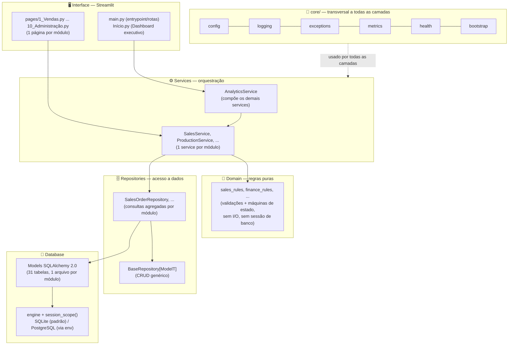
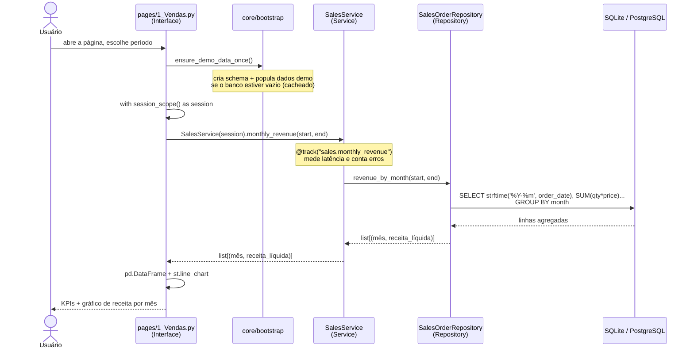
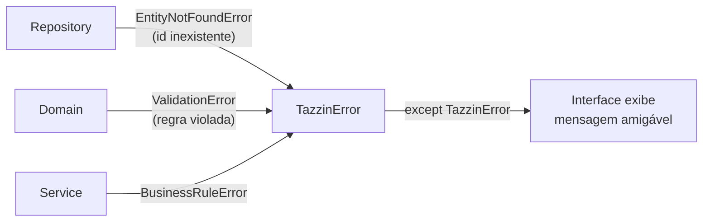
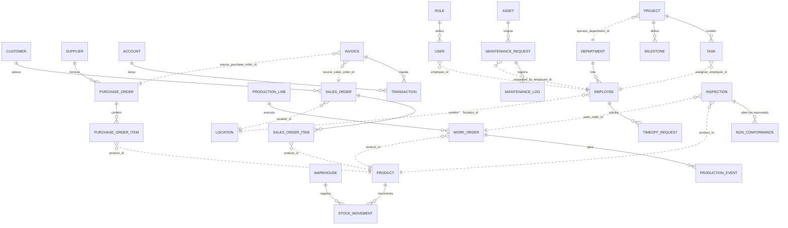
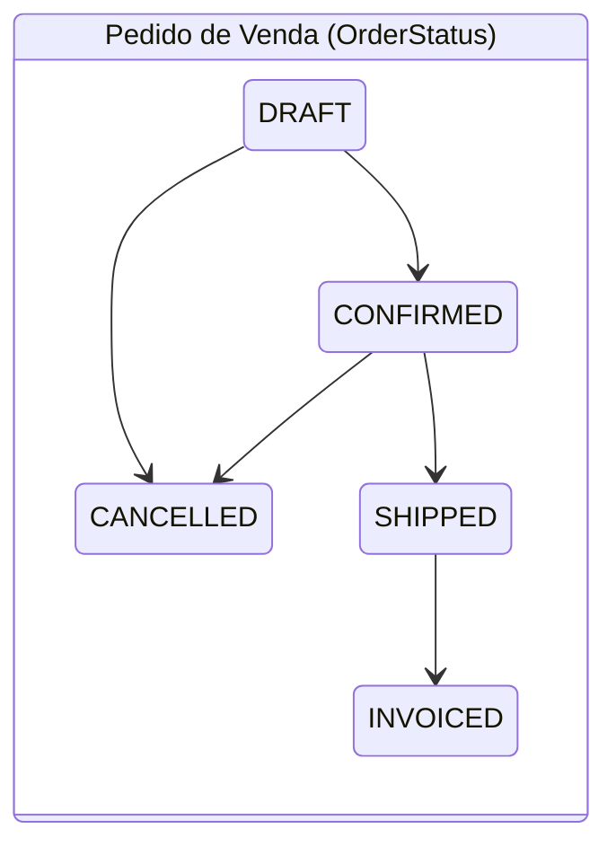
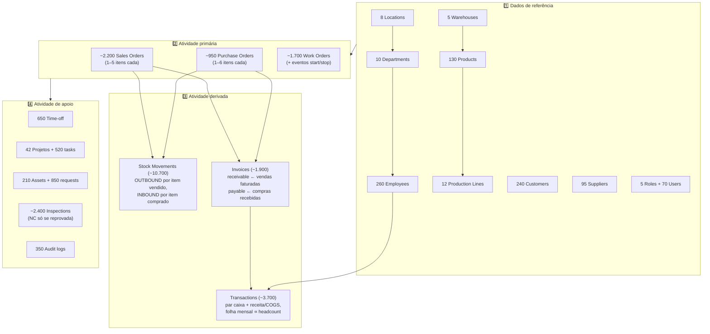

# Sistema TAZZIN — Documentação Técnica Completa

> **Plataforma de Inteligência Operacional Empresarial** — documentação de referência
> para desenvolvedores, arquitetos e avaliadores técnicos.
>
> Repositório: [github.com/DouglasTassinari/Tazzin](https://github.com/DouglasTassinari/Tazzin) · Licença: MIT · Python ≥ 3.11

---

## Índice

1. [Visão Geral](#1-visão-geral)
2. [Arquitetura](#2-arquitetura)
3. [Estrutura de Pastas](#3-estrutura-de-pastas)
4. [Fluxo da Aplicação](#4-fluxo-da-aplicação)
5. [Módulos](#5-módulos)
6. [Componentes Reutilizáveis](#6-componentes-reutilizáveis)
7. [Organização do Domínio](#7-organização-do-domínio)
8. [Fluxo de Dados](#8-fluxo-de-dados)
9. [Boas Práticas Encontradas](#9-boas-práticas-encontradas)
10. [Pontos de Melhoria](#10-pontos-de-melhoria)
11. [Roadmap Técnico](#11-roadmap-técnico)
12. [Conexão com Outros Projetos](#12-conexão-com-outros-projetos)
13. [Organização do GitHub](#13-organização-do-github)
14. [Resumo Executivo](#14-resumo-executivo)

---

## 1. Visão Geral

**Sistema TAZZIN** é a plataforma de gestão de operações industriais da marca
TAZZIN — *menos planilhas, mais controle*. Ela cobre, em um só lugar, o que
normalmente vive espalhado em uma planilha por departamento:

- **13 módulos de negócio** em 15 páginas: Vendas, Relacionamento, Radar de
  Oportunidades, Produção, Usinagem, Refugo, Ajustes, Estoque, Compras,
  Financeiro, Pessoas, Projetos, Manutenção, Qualidade e Administração;
- **38 tabelas** com **~46.000 linhas sintéticas** coerentes entre si (a venda gera
  movimento de estoque, que gera fatura, que gera transação de caixa);
- **244 testes automatizados** rodando em ~4 segundos contra SQLite em memória;
- **Observabilidade embutida**: logging estruturado em JSON, health checks e
  registro de métricas por operação, tudo visível na página de Administração.

O que este projeto **é**: a arquitetura de referência da plataforma — camadas
estritas, baixo acoplamento e testabilidade real.

O que este projeto **não é**: um retrato de dados de nenhuma empresa real — o
dataset é 100% sintético e gerado por script.

Quem chega pela primeira vez deve começar por: `README.md` → este documento →
[`docs/ARCHITECTURE.md`](ARCHITECTURE.md) → o código do módulo de Vendas
(o padrão dos outros 9 módulos é idêntico).

---

## 2. Arquitetura

### 2.1 Estilo arquitetural

O projeto usa **arquitetura em camadas (Layered Architecture)** com direção de
dependência estritamente unidirecional, combinada com **modularização vertical
por domínio de negócio** (cada módulo atravessa todas as camadas com seus
próprios arquivos). É essencialmente um *modular monolith*.



### 2.2 Papel de cada camada

| Camada | Diretório | Responsabilidade | O que é proibido |
|---|---|---|---|
| **Interface** | `app/Início.py`, `app/pages/` | Renderizar KPIs e gráficos; coletar filtros do usuário | Importar repositório ou model diretamente — só fala com o *service* do seu módulo |
| **Services** | `app/services/` | Orquestrar: chamar repositórios, aplicar regras de domínio, logar, medir latência (`@track`) | Falar com repositório/model de **outro** módulo (exceção: `AnalyticsService`) |
| **Domain** | `app/domain/` | Validações e máquinas de estado como **funções puras** | Qualquer I/O: sem sessão de banco, sem Streamlit, sem filesystem |
| **Repositories** | `app/repositories/` | Consultas SQLAlchemy: CRUD herdado do `BaseRepository` + agregações específicas (KPIs, séries mensais) | Conter regra de negócio; ser importado pela interface |
| **Database** | `app/database/` | Models declarativos (estilo `Mapped[...]`), engine, factory de sessão, `session_scope()` transacional | `relationship()` cruzando fronteira de módulo |
| **Core** | `app/core/` | Preocupações transversais: config, logging, exceções, métricas, health, bootstrap | Conhecer módulos de negócio específicos |

### 2.3 Regras de dependência (o contrato da arquitetura)

1. **Página → Service → Repository → Model**, nunca pulando camadas.
2. **Um service só acessa repositórios do próprio módulo.** Se Vendas precisa do
   nome de um produto, pergunta ao service de Estoque — nunca importa o model
   `Product`.
3. **Referências entre módulos são colunas de FK simples** (`product_id: int`),
   nunca `relationship()` do SQLAlchemy atravessando módulos. Dentro do módulo
   (ex.: `Customer → SalesOrder → SalesOrderItem`), `relationship()` é usado
   normalmente, pois a coesão ali é intencional.
4. **`AnalyticsService` é a única exceção documentada**: compõe os services dos
   outros módulos para montar o snapshot executivo do Dashboard. Não possui
   tabelas próprias.
5. **Ninguém lê `os.environ` fora de `app/core/config.py`.**

O porquê dessas regras: qualquer módulo pode evoluir seu schema, ser testado ou
até extraído para outro serviço sem tocar nos demais. O acoplamento entre
módulos se reduz a um **contrato de IDs**.

---

## 3. Estrutura de Pastas

```
Tazzin/
├── app/                      # todo o código da aplicação
│   ├── core/                 # transversal: config, logging, exceções, métricas, health, bootstrap
│   ├── database/             # engine, sessão e models (1 arquivo por módulo)
│   │   └── models/
│   ├── domain/               # regras de negócio puras (1 arquivo por módulo)
│   ├── repositories/         # acesso a dados (base genérica + 1 arquivo por módulo)
│   ├── services/             # orquestração (1 arquivo por módulo + analytics)
│   ├── pages/                # páginas Streamlit (1 por módulo)
│   ├── Início.py             # página inicial — Dashboard executivo
│   └── main.py               # entrypoint — registra as páginas (st.navigation)
├── scripts/                  # utilitários CLI (fora do runtime da aplicação)
├── tests/                    # espelha app/: test_domain, test_repositories, test_services
├── docs/                     # documentação de arquitetura e operação
├── data/                     # SQLite gerado em runtime (gitignored)
├── logs/                     # logs rotativos gerados em runtime (gitignored)
├── pyproject.toml            # metadados + config de ruff e pytest
├── requirements.txt          # dependências de runtime
├── CONTRIBUTING.md           # como adicionar um módulo novo
└── README.md
```

### Detalhamento por pasta

| Pasta | Finalidade | Depende de | É usada por |
|---|---|---|---|
| `app/core/` | Configuração (`Settings` congelada via env vars), logging JSON rotativo, hierarquia de exceções, `MetricsRegistry` thread-safe, health checks, bootstrap de dados demo | Nada interno (apenas stdlib + SQLAlchemy no health) | **Todas** as camadas |
| `app/database/` | `base.py` (engine, `SessionLocal`, `Base`, `session_scope()`); `models/` com 11 arquivos (10 módulos + `core.py` com `Location` e `TimestampMixin`) | `app/core/config` | Repositories, scripts, testes |
| `app/domain/` | 10 arquivos `*_rules.py`: validações (`validate_discount`, `validate_line_item`...) e máquinas de estado (`can_transition` / `assert_transition`) | `app/core/exceptions` (+ enums dos models — ver §10) | Services e testes de domínio |
| `app/repositories/` | `base.py` com `BaseRepository[ModelT]` (get, list, add, add_many, delete, count) + 10 repositórios com consultas agregadas (receita por mês, top clientes, yield por linha...) | `app/database/`, `app/core/` | Services e testes de repositório |
| `app/services/` | 10 services de módulo + `AnalyticsService`. Cada método público é decorado com `@track("modulo.metodo")` e loga via `get_logger("services.modulo")` | Repositories, domain, core | Páginas e testes de service |
| `app/pages/` | 10 páginas Streamlit numeradas (`1_Vendas.py` ... `10_Administração.py`), interface em pt-BR. Cada uma chama `ensure_demo_data_once()` no topo | Apenas o service do próprio módulo + `session_scope` | Usuário final |
| `scripts/` | `generate_synthetic_data.py` (gerador de ~44k linhas, determinístico por `--seed`), `init_db.py`, `run_health_check.py` (probe CLI, exit 1 se degradado) | `app/database/`, `app/core/` | Operador / cron / bootstrap |
| `tests/` | `conftest.py` (fixture de SQLite em memória por teste) + 30 arquivos de teste espelhando domain/repositories/services | `app/` inteiro | CI / desenvolvedor |
| `docs/` | `ARCHITECTURE.md`, `MODULES.md`, `HOW_TO_RUN.md`, `DATA_GENERATION.md` e este documento | — | Humanos 🙂 |

---

## 4. Fluxo da Aplicação

### 4.1 Fluxo de leitura (o caso dominante — dashboards)

Exemplo real: usuário abre a página **Vendas** e filtra o último ano.



Etapa por etapa:

1. **Usuário** abre a página e define o filtro de datas (padrão: últimos 365 dias).
2. **Interface** garante o bootstrap (`ensure_demo_data_once()` — no-op depois da
   primeira execução no processo, graças a `st.cache_resource`), abre uma sessão
   transacional com `session_scope()` e instancia o service.
3. **Service** delega a consulta ao repositório. O decorator `@track` registra
   contagem, latência média e erros no `MetricsRegistry` — que a página de
   Administração exibe ao vivo.
4. **Repository** monta o `select()` do SQLAlchemy com agregação e devolve
   tuplas simples `(mês, valor)` — já no formato que a interface consome.
5. **Database**: `session_scope()` faz commit no sucesso e rollback em exceção.
6. **Interface** converte para DataFrame e renderiza métricas e gráficos.

### 4.2 Fluxo de escrita (com regra de domínio)

Exemplo: `SalesService.create_order(...)` e `transition_order(...)`:

```
Usuário/chamador
   ↓
SalesService.create_order()
   ├── sales_rules.validate_discount(discount_pct)      ← Domain: pode lançar ValidationError
   ├── sales_rules.validate_line_item(qty, price)       ← Domain: pura, sem banco
   ├── SalesOrderRepository.add(order)                  ← Repository: session.add + flush
   └── logger.info("Created sales order ...")           ← Core: log JSON estruturado
   ↓
session_scope() → commit (ou rollback se ValidationError subiu)
```

A transição de status (`DRAFT → CONFIRMED → SHIPPED → INVOICED`) passa por
`assert_transition(atual, alvo)`; transição inválida lança `ValidationError`,
que herda de `TazzinError` — a interface só precisa capturar a base da
hierarquia para exibir mensagem amigável, independentemente da camada de origem.

### 4.3 Fluxo de erro



---

## 5. Módulos

Todos os 10 módulos de negócio seguem o **mesmo padrão de 5 arquivos**
(model → rules → repository → service → page), o que torna o aprendizado de um
módulo transferível para todos os outros. `Analytics` é o 11º componente,
sem tabelas próprias.

| # | Módulo | Entidades | Regras de domínio principais | KPIs na página |
|---|---|---|---|---|
| 1 | **Vendas** (`sales`) | Customer, SalesOrder, SalesOrderItem | Desconto máx. 25%; qty/preço positivos; máquina de estados do pedido | Receita líquida, clientes ativos, receita/mês, top 10 clientes |
| 2 | **Produção** (`production`) | ProductionLine, WorkOrder, ProductionEvent | Máquina de estados da ordem; cálculo de yield e scrap | Ordens no período, yield médio %, scrap total, yield por linha |
| 3 | **Estoque** (`inventory`) | Warehouse, Product, StockMovement | Ponto de ressuprimento (low-stock); validação de movimento | SKUs ativos, produtos em low-stock, unidades em mãos, top 15 por saldo |
| 4 | **Compras** (`purchasing`) | Supplier, PurchaseOrder, PurchaseOrderItem | Máquina de estados do pedido; rating de fornecedor | Gasto total, fornecedores ativos, rating médio, gasto/mês, top 10 |
| 5 | **Financeiro** (`finance`) | Account, Invoice, Transaction | Máquina de estados da fatura (OPEN → PAID/OVERDUE); aging | Contas a receber/pagar pendentes, fluxo de caixa líquido/mês |
| 6 | **Pessoas** (`people`) | Department, Employee, TimeOffRequest | Aprovação de férias; status de vínculo | Headcount ativo, solicitações pendentes, dias aprovados, headcount/depto |
| 7 | **Projetos** (`projects`) | Project, Task, Milestone | Máquina de estados do projeto; taxa de conclusão | Projetos ativos, conclusão média, próximos milestones |
| 8 | **Manutenção** (`maintenance`) | Asset, MaintenanceRequest, MaintenanceLog | Máquina de estados da solicitação; criticidade de ativo | Solicitações abertas, custo no período, ativos críticos, custo/mês |
| 9 | **Qualidade** (`quality`) | Inspection, NonConformance, QualityMetric | NC criada apenas para inspeção reprovada; workflow da NC | Taxa média de defeitos, NCs abertas, pass rate, defeitos/mês |
| 10 | **Administração** (`administration`) | Role, User, AuditLog | Usuário ativo/inativo; trilha de auditoria | Usuários ativos, status de saúde, uptime, métricas por operação |
| — | **Analytics** (Dashboard) | *(nenhuma — compõe os services acima)* | Agregação de KPIs cross-módulo | Receita, gasto, caixa, projetos, yield, defeitos, manutenção, headcount |

### Arquivos de cada módulo (padrão)

Para um módulo `<m>` qualquer:

| Camada | Arquivo | Teste correspondente |
|---|---|---|
| Model | `app/database/models/<m>.py` | *(coberto via repositório)* |
| Domain | `app/domain/<m>_rules.py` | `tests/test_domain/test_<m>_rules.py` |
| Repository | `app/repositories/<m>_repository.py` | `tests/test_repositories/test_<m>_repository.py` |
| Service | `app/services/<m>_service.py` | `tests/test_services/test_<m>_service.py` |
| Page | `app/pages/N_<Módulo>.py` | *(camada fina, sem lógica testável)* |

O passo a passo para criar um módulo novo está em [`CONTRIBUTING.md`](../CONTRIBUTING.md).

---

## 6. Componentes Reutilizáveis

Estes componentes são agnósticos de módulo e poderiam ser extraídos para uma
biblioteca compartilhada entre projetos (ver §12):

### 6.1 `app/core/config.py` — Configuração centralizada

`Settings` é um `dataclass(frozen=True)` populado por variáveis de ambiente
(`TAZZIN_DATABASE_URL`, `TAZZIN_ENV`, `TAZZIN_LOG_LEVEL`,
`TAZZIN_LOG_FORMAT`) com defaults de demo zero-config. Nenhum outro arquivo
lê `os.environ`. Trocar SQLite por PostgreSQL é alterar **uma** variável.

### 6.2 `app/core/logging.py` — Logging estruturado

- `get_logger(name)` devolve logger com namespace `tazzin.<name>`;
- Formato JSON por linha (machine-parseable) ou texto, escolhido por env var;
- Saída dupla: stdout + `logs/tazzin.log` rotativo (5 MB × 3 backups);
- Bônus: `timed_block`, context manager que loga a duração de um bloco.

### 6.3 `app/core/exceptions.py` — Hierarquia de exceções

```
TazzinError
├── DataAccessError
│   └── EntityNotFoundError   (carrega entity_name + entity_id)
└── BusinessRuleError
    └── ValidationError
```

A interface captura apenas `TazzinError`; a granularidade existe para quem
precisa distinguir "não achei" de "não é permitido".

### 6.4 `app/core/metrics.py` — Métricas em processo

`MetricsRegistry` thread-safe (contadores + timings por operação) e o decorator
`@track("modulo.metodo")` que envolve todo método público de service, medindo
contagem, latência média e erros — inclusive quando a exceção sobe (o `finally`
registra e re-lança). A página de Administração renderiza o `snapshot()` ao vivo.

### 6.5 `app/core/health.py` — Health checks

`run_health_checks()` executa probes de banco (`SELECT 1` com latência) e de
escrita em disco, devolvendo um `HealthReport` agregado. Consumido por dois
clientes: a página de Administração (visual) e `scripts/run_health_check.py`
(CLI, exit code 1 se degradado — pronto para cron/uptime monitor).

### 6.6 `app/core/bootstrap.py` — Bootstrap de dados demo

`ensure_demo_data_once()`: cria o schema e popula o dataset sintético **apenas
se o banco estiver vazio**; cacheado por `st.cache_resource` para ser no-op após
a primeira chamada. Existe porque páginas Streamlit são scripts independentes —
um visitante pode entrar por deep-link em qualquer página antes de a home rodar.
É o que faz o deploy no Streamlit Community Cloud subir já populado.

### 6.7 `app/repositories/base.py` — Repositório genérico

`BaseRepository[ModelT]` concentra o CRUD (get com `EntityNotFoundError`,
`get_or_none`, list paginado, add, add_many, delete, count). Os 10 repositórios
de módulo herdam dele e só adicionam as consultas agregadas específicas —
zero boilerplate repetido.

### 6.8 `app/database/base.py` — Sessão transacional

`session_scope()` é um context manager que faz commit no sucesso, rollback na
exceção e close sempre. Um único `Base` declarativo garante que
`Base.metadata.create_all()` construa as 31 tabelas de uma vez.

### 6.9 `TimestampMixin` e `Location` (`app/database/models/core.py`)

- `TimestampMixin`: `created_at`/`updated_at` com `server_default=func.now()`,
  herdado por todas as entidades relevantes;
- `Location`: entidade física compartilhada (planta/armazém/escritório)
  referenciada por Produção, Estoque e Pessoas.

### 6.10 `tests/conftest.py` — Infraestrutura de teste

Fixture `session` que cria um SQLite **em memória por teste** a partir do
`Base.metadata` real (sem mocks), mais fixtures de `location` e `product`
prontos. É o que permite 153 testes isolados em ~2s.

---

## 7. Organização do Domínio

### 7.1 Mapa de entidades e relacionamentos

Linhas contínuas = `relationship()` ORM (dentro do módulo).
Linhas tracejadas = referência por **FK simples** entre módulos (o contrato de IDs).



### 7.2 Máquinas de estado (regras de transição)

Sete módulos modelam ciclos de vida como máquinas de estado explícitas em
`domain/*_rules.py`. Transição inválida lança `ValidationError`, e cada máquina
tem teste direto em `tests/test_domain/`.



| Módulo | Máquina de estados |
|---|---|
| Vendas | `DRAFT → CONFIRMED → SHIPPED → INVOICED` (CANCELLED a partir de DRAFT/CONFIRMED) |
| Produção | `PLANNED → IN_PROGRESS → COMPLETED` (ou CANCELLED) |
| Compras | `DRAFT → SENT → CONFIRMED → RECEIVED` (ou CANCELLED) |
| Financeiro | `OPEN → PAID` / `OVERDUE → PAID` (ou CANCELLED) |
| Projetos | `PLANNING → ACTIVE → ON_HOLD / COMPLETED` (ou CANCELLED) |
| Manutenção | `OPEN → SCHEDULED → IN_PROGRESS → COMPLETED` (ou CANCELLED) |
| Qualidade | `OPEN → UNDER_REVIEW → RESOLVED → CLOSED` |

### 7.3 Regras de negócio de validação (exemplos)

| Regra | Onde vive | Comportamento |
|---|---|---|
| Desconto máximo de 25% em pedido de venda | `sales_rules.validate_discount` | `ValidationError` fora de 0–25% |
| Quantidade e preço unitário positivos | `sales_rules.validate_line_item` | `ValidationError` se ≤ 0 |
| Valor líquido = bruto × (1 − desconto) | `sales_rules.calculate_net_amount` | Função pura, arredondada a 2 casas |
| NC só nasce de inspeção reprovada | `quality_rules` + gerador de dados | Coerência do dataset |
| Low-stock = saldo abaixo do `reorder_point` | `inventory_rules` | Alimenta o KPI de estoque |

O ponto central: **essas regras são funções puras** — testáveis com valores
crus, sem fixture de banco, e reutilizáveis por uma futura API REST ou CLI sem
duplicação.

---

## 8. Fluxo de Dados

### 8.1 Origem: geração sintética coerente

Os dados **não** são tabelas aleatórias independentes — são derivados em cadeia,
como numa empresa real:



Escolhas de realismo dignas de nota (detalhes em [`DATA_GENERATION.md`](DATA_GENERATION.md)):

- **Taxa de defeitos** segue distribuição beta enviesada (`betavariate(0.5, 45)`):
  ~83% PASS, ~16% REWORK, <1% FAIL — parece um processo de qualidade funcional;
- **Status de fatura** depende da idade do vencimento (aging crível, não sorteio);
- **Janela temporal**: 2023-01-01 até "hoje", então todo run termina no presente;
- **Determinístico**: mesmo `--seed` → mesmo dataset.

### 8.2 Percurso runtime: do banco à tela

```
generate_synthetic_data.py ──grava──▶ data/tazzin.db (SQLite)
                                          │
                                          ▼
                            Repository (select + agregação SQL)
                                          │  tuplas (mês, valor) / entidades ORM
                                          ▼
                            Service (regras + @track + log)
                                          │  dicts e listas prontos p/ exibição
                                          ▼
                            Página Streamlit (pandas DataFrame)
                                          │
                                          ▼
                            st.metric / st.line_chart / st.dataframe
```

Duas decisões importantes nesse trajeto:

1. **Agregação acontece no banco** (`SUM`, `GROUP BY` por mês), não em Python —
   os repositórios devolvem séries já reduzidas, então a interface nunca carrega
   44 mil linhas na memória.
2. **A sessão vive no escopo da página** (`with session_scope()`): tudo que a
   página precisa é materializado dentro do bloco; commit/rollback é automático.

### 8.3 Dados de observabilidade (fluxo paralelo)

Cada chamada de service alimenta dois fluxos secundários que convergem na página
de Administração: o `MetricsRegistry` (contagem/latência/erros por operação) e o
log JSON rotativo. O health check junta a isso probes de banco e disco.

---

## 9. Boas Práticas Encontradas

| # | Prática | Onde | Por que importa |
|---|---|---|---|
| 1 | **Direção de dependência estrita e documentada** | Toda a base | Evita o "big ball of mud"; cada camada é substituível e testável isolada |
| 2 | **Fronteiras de módulo por contrato de IDs** (FK sem `relationship()` cross-module) | `database/models/*` | Schema de um módulo evolui sem quebrar os outros; decisão explicitamente justificada nos docstrings |
| 3 | **Regras de domínio como funções puras** | `app/domain/` | Testes sem fixture de banco; regras reutilizáveis por uma futura API |
| 4 | **Repositório genérico tipado** (`BaseRepository[ModelT]` com `Generic`/`TypeVar`) | `repositories/base.py` | CRUD em um único lugar; repositórios de módulo só têm o que é específico |
| 5 | **Testes contra banco real em memória, não mocks** | `tests/conftest.py` | Pega erro de schema/FK/SQL que mock esconderia; suíte inteira em ~2s |
| 6 | **Exceções em hierarquia única** | `core/exceptions.py` | Interface captura 1 tipo; granularidade disponível quando necessária |
| 7 | **Observabilidade desde o dia 1** (log JSON, `@track`, health check) | `core/` + Administração | Raro em projeto de portfólio; demonstra mentalidade de produção |
| 8 | **Configuração 12-factor** (env vars em um único ponto, `Settings` frozen) | `core/config.py` | Troca de backend de banco sem tocar em código |
| 9 | **Dataset sintético derivado, não aleatório** | `scripts/generate_synthetic_data.py` | Dashboards contam uma história coerente; determinismo por seed facilita debug |
| 10 | **Bootstrap idempotente para cloud** | `core/bootstrap.py` | Deploy no Streamlit Cloud sobe populado; banco existente nunca é tocado |
| 11 | **SQLAlchemy 2.0 moderno** (`Mapped[...]`/`mapped_column`, `select()`) | `database/` | Estilo atual da biblioteca, tipado, sem API legada |
| 12 | **Type hints + `from __future__ import annotations` em todo módulo** | Toda a base | Base pronta para mypy/pyright |
| 13 | **Docstrings que explicam o *porquê*** (não o óbvio) | Ex.: `models/sales.py`, `bootstrap.py` | Decisões arquiteturais sobrevivem à memória do autor |
| 14 | **Convenção de nomes 100% previsível** (`<m>_rules`, `<m>_repository`, `<m>_service`, `N_<Módulo>.py`) | Toda a base | Custo de navegação ~zero; aprender 1 módulo = aprender os 10 |
| 15 | **Commits convencionais** (`feat:`, `fix:`, `i18n:`) | Histórico git | Changelog derivável; histórico legível |
| 16 | **Lint configurado** (ruff com `E`, `F`, `I`) | `pyproject.toml` | Imports ordenados e erros básicos bloqueados |
| 17 | **CONTRIBUTING com receita concreta de extensão** | `CONTRIBUTING.md` | O padrão da casa está escrito, não é folclore |

---

## 10. Pontos de Melhoria

Análise sob a ótica de arquitetura — não de estilo de código. Ordenados por impacto.

### 10.1 Portabilidade real do banco está quebrada (contradiz a documentação)

`ARCHITECTURE.md` e `HOW_TO_RUN.md` prometem "troque para PostgreSQL sem mudar
código", mas os repositórios usam **`func.strftime("%Y-%m", ...)`** (ex.:
`sales_repository.revenue_by_month`) — função **exclusiva do SQLite**. No
PostgreSQL isso falha em runtime.
**Correção sugerida:** trocar por uma expressão portátil (ex.:
`func.to_char` vs `strftime` selecionada por dialeto, ou extrair um helper
`month_bucket(column)` em `repositories/base.py`) e adicionar um job de CI que
rode a suíte também contra PostgreSQL (service container).

### 10.2 A camada de domínio importa da camada de banco

`app/domain/sales_rules.py` importa `OrderStatus` de
`app.database.models.sales` — o mesmo ocorre nos demais módulos. Isso **inverte
a direção de dependência declarada**: o domínio (camada mais pura) depende da
infraestrutura (SQLAlchemy).
**Correção sugerida:** mover os enums de status para `app/domain/` (ou um
`app/domain/<m>_types.py`) e fazer os models importarem do domínio. O domínio
volta a ser importável sem SQLAlchemy instalado.

### 10.3 Sem migrações de schema (Alembic)

O schema nasce de `Base.metadata.create_all()`. Funciona para demo, mas
qualquer evolução de schema com dados existentes exige recriar o banco.
**Sugestão:** adotar Alembic com autogenerate; é também o que um avaliador
técnico espera ver ao lado de SQLAlchemy.

### 10.4 Services devolvem entidades ORM para a interface

As páginas recebem objetos mapeados (ex.: `active_customers()` → `list[Customer]`)
e os leem fora do controle do service. Hoje funciona porque tudo roda dentro do
`session_scope` da página, mas: (a) acopla a interface ao ORM; (b) cria risco de
`DetachedInstanceError` se alguém acessar atributo lazy fora do escopo; (c)
impede cache dos resultados.
**Sugestão:** introduzir DTOs leves (dataclasses/`pydantic`) como modelo de
leitura na fronteira service → interface.

### 10.5 Ausência de CI

Não há GitHub Actions: `pytest` e `ruff` só rodam na máquina de quem lembra de
rodar. Para um repositório que se propõe a ser referência, o selo verde de CI é
parte da mensagem. (Detalhes no §13.)

### 10.6 Ausência de autenticação na interface

Existe modelo de `User`/`Role` no módulo Administração, mas o dashboard em si é
aberto. Para demo pública tudo bem; documente isso explicitamente ou adicione
um gate simples (ex.: `streamlit-authenticator`) consumindo as tabelas que já
existem — viraria inclusive uma feature de portfólio.

### 10.7 Métricas morrem com o processo

O `MetricsRegistry` é um singleton em memória: reinicie o processo e o histórico
zera; múltiplos workers não compartilham nada. Já está honestamente documentado
no docstring. **Evolução natural:** expor as métricas em formato Prometheus
(um endpoint/arquivo text-based) mantendo o registro atual como implementação.

### 10.8 Boilerplate de `sys.path` duplicado em 12 arquivos

Todo entrypoint Streamlit repete o bloco de bootstrap do `sys.path`.
**Sugestão:** empacotar o projeto (`pip install -e .` com `[project]` completo
no `pyproject.toml` — hoje ele nem declara dependências) e/ou centralizar o
bootstrap. Isso também unificaria `requirements.txt` e `pyproject.toml`, que
atualmente divergem em responsabilidade.

### 10.9 Precisão monetária

Valores monetários são `Numeric` no banco, mas convertidos para `float` nas
propriedades e agregações (`net_amount`, somas em Python). Para BI de demo é
aceitável; para "referência", padronizar em `decimal.Decimal` de ponta a ponta
eliminaria erros de arredondamento.

### 10.10 Aproximação matemática na receita mensal

`revenue_by_month` aplica `AVG(discount_pct)` sobre o `SUM` bruto do mês — uma
aproximação: o resultado exato seria somar o líquido por pedido. Com descontos
pequenos a diferença é irrelevante, mas o KPI do mês pode divergir da soma dos
pedidos individuais. Vale um comentário no código ou o cálculo exato via
subquery por pedido.

### 10.11 i18n por hardcode

A tradução pt-BR foi feita substituindo strings nas páginas (e renomeando
arquivos). Uma camada fina de i18n (dict de strings ou `gettext`) permitiria
alternar idioma — relevante se o repositório quer alcançar audiência
internacional com a interface em inglês e o público local em português.

### 10.12 Nomenclatura do repositório

Produto, pacote, repositório e deploy já são `tazzin`. Sobra um resíduo: a
**pasta local** de trabalho ainda se chama `OpsVision2`. Nada no código
depende disso (o `sys.path` é resolvido em runtime a partir do arquivo), mas
renomeá-la evita confusão em clones e em paths de CI.

O repositório foi renomeado de `OpsVision` para `Tazzin` no GitHub. Clones
antigos continuam funcionando por causa do redirect que o GitHub mantém, mas
convém reapontar o remote:

```bash
git remote set-url origin https://github.com/DouglasTassinari/Tazzin.git
```

---

## 11. Roadmap Técnico

### Curto prazo (1–2 semanas) — credibilidade imediata

| Item | Entrega | Por quê primeiro |
|---|---|---|
| **CI no GitHub Actions** | Workflow com `ruff check` + `pytest` em Python 3.11/3.12 + badge no README | É o selo de qualidade mais visível que existe |
| **Corrigir portabilidade SQL** (§10.1) | Helper de bucket mensal por dialeto + job de CI contra PostgreSQL | Torna verdadeira a promessa da documentação |
| **Release v1.0.0** | Tag git + GitHub Release com changelog | O `pyproject.toml` já diz 1.0.0; formalizar |
| **README com evidência visual** | Screenshot/GIF do Dashboard + link para demo no Streamlit Community Cloud | Recrutador decide em 30 segundos; imagem > texto |
| **Inverter dependência dos enums** (§10.2) | Enums de status movidos para `app/domain/` | Barato agora, caro depois |

### Médio prazo (1–2 meses) — profundidade de engenharia

| Item | Entrega |
|---|---|
| **Alembic** | Migração inicial + autogenerate; documentar workflow de evolução de schema |
| **Camada de API (FastAPI)** | Endpoints read-only (`/api/kpis`, `/api/sales/revenue`) reutilizando os mesmos services — prova na prática que a arquitetura suporta múltiplas interfaces |
| **DTOs na fronteira service→UI** (§10.4) | Dataclasses de leitura; páginas param de tocar em objetos ORM |
| **Autenticação** | Login na interface usando as tabelas `User`/`Role` já existentes |
| **Qualidade estática** | `mypy` no CI, cobertura com `pytest-cov` + badge, `pre-commit` |
| **Docker** | `Dockerfile` + `docker-compose.yml` (app + PostgreSQL) para subir com um comando |
| **Docs publicadas** | MkDocs Material + GitHub Pages servindo o conteúdo de `docs/` |

### Longo prazo (3–6 meses) — plataforma

| Item | Entrega |
|---|---|
| **Pacote core compartilhado** | Extrair `core/` (logging, métricas, health, exceções, config) + `BaseRepository` para um pacote instalável reutilizado por outros projetos (ver §12) |
| **Observabilidade real** | Export Prometheus + dashboard Grafana de exemplo; tracing opcional (OpenTelemetry) |
| **Camada analítica avançada** | Previsões simples (receita, demanda) sobre o dataset — o dado sintético multi-ano já suporta |
| **Eventos entre módulos** | Substituir chamadas síncronas do fluxo derivado por eventos de domínio (in-process primeiro), demonstrando evolução para arquitetura orientada a eventos |
| **i18n formal** | Interface pt-BR/en-US alternável |

---

## 12. Conexão com Outros Projetos

O Sistema TAZZIN foi desenhado com fronteiras que tornam partes dele **extraíveis**.
Oportunidades concretas de integração com o ecossistema do autor (portfólio,
Jornada Brasil e projetos futuros):

### 12.1 Pacote compartilhado `core` (a oportunidade nº 1)

Tudo em `app/core/` + `repositories/base.py` é agnóstico de negócio.
Extraído como pacote (ex.: `dtassinari-core` ou `tazzin-core`), qualquer
projeto Python do autor ganharia de graça:

| Componente | O que outros projetos ganham |
|---|---|
| `logging.py` | Log JSON estruturado + rotação com 1 import |
| `metrics.py` | `@track` + registry de latência/erros |
| `health.py` | Health check com probes plugáveis + CLI exit-code |
| `exceptions.py` | Hierarquia base de erros de aplicação |
| `config.py` | Padrão de Settings frozen via env vars |
| `BaseRepository` | CRUD genérico tipado para qualquer projeto SQLAlchemy |

Um monorepo de "platform tools" ou um pacote publicado no PyPI (mesmo que
`pip install git+https://...`) demonstra pensamento de plataforma — algo que
diferencia sênior de pleno em avaliação técnica.

### 12.2 Portfólio pessoal

- **Demo viva**: deploy no Streamlit Community Cloud (o bootstrap automático já
  foi construído exatamente para isso) e link direto no portfólio — o visitante
  interage com o dashboard em vez de ler sobre ele;
- **Estudo de caso**: este documento (§2, §7, §10) vira um artigo/post
  "Como estruturei um monolito modular em Python" — conteúdo técnico de
  portfólio com muito mais alcance que o repositório sozinho;
- **API como vitrine**: a futura camada FastAPI (§11) permite que o site do
  portfólio consuma KPIs reais do Sistema TAZZIN e os exiba como widgets.

### 12.3 Jornada Brasil e outras plataformas

Sem acesso ao código desses projetos, as conexões de maior probabilidade são:

- **Reutilizar o padrão, não só o código**: o "kit de módulo" (model → rules →
  repository → service → page + testes espelhados) descrito no `CONTRIBUTING.md`
  é um template aplicável a qualquer domínio — inclusive conteúdo educacional ou
  jornadas de usuário;
- **Gerador de dados sintéticos como biblioteca**: a técnica de "atividade
  derivada de atividade upstream" com Faker + seed determinístico serve para
  qualquer projeto que precise de dados demo críveis (e-commerce, educação,
  logística). Extrair o esqueleto do `generate_synthetic_data.py` para um
  utilitário genérico beneficiaria todos os projetos do autor;
- **Padrões operacionais compartilhados**: o mesmo workflow de CI, o mesmo
  `CONTRIBUTING.md`, a mesma convenção de commits — consistência entre
  repositórios é em si um sinal profissional forte (ver §13.6).

### 12.4 Integrações externas futuras

| Integração | Caminho técnico já preparado |
|---|---|
| BI externo (Metabase/Superset) | Apontar para o mesmo PostgreSQL via `TAZZIN_DATABASE_URL` |
| Monitoramento (UptimeRobot, cron) | `scripts/run_health_check.py` já retorna exit code |
| Prometheus/Grafana | `MetricsRegistry.snapshot()` já tem o shape certo para um exporter |
| Consumidores de API | Services já isolados — a camada FastAPI é aditiva, sem refatoração |

---

## 13. Organização do GitHub

### 13.1 Diagnóstico do estado atual

**Pontos fortes** (acima da média de repositórios de portfólio):

- README objetivo, com quick start funcional e links para docs mais profundas;
- `docs/` com 4 documentos de qualidade (arquitetura com *porquês*, referência
  de módulos, guia de execução, geração de dados);
- `CONTRIBUTING.md` com receita real de extensão;
- LICENSE (MIT) e `.gitignore` corretos (artefatos de runtime fora do repo);
- Histórico de commits limpo, com prefixos convencionais e mensagens descritivas.

**Lacunas** (o que separa "bom" de "referência"):

| Lacuna | Impacto |
|---|---|
| Sem CI/CD | Nenhuma prova automatizada de que os 244 testes passam; sem badge |
| Sem tags/releases | `pyproject.toml` diz v1.0.0, mas o GitHub não conta essa história |
| Sem evidência visual no README | Um dashboard sem screenshot é uma tese sem gráfico |
| Sem demo pública linkada | O bootstrap para cloud existe, mas não há link de demo |
| Sem *About*/topics no repositório | Descoberta e primeira impressão prejudicadas |
| Sem templates de issue/PR | Sinaliza projeto não preparado para colaboração |
| Pasta local ainda chamada `OpsVision2` (repo já é `Tazzin`) | Fricção pequena, mas evitável |

### 13.2 README — melhorias específicas

1. **Topo com badges**: CI, cobertura, Python 3.11+, licença MIT, link da demo;
2. **Screenshot ou GIF** do Dashboard logo após o primeiro parágrafo;
3. **Diagrama Mermaid de arquitetura** direto no README (o GitHub renderiza) —
   a versão resumida do diagrama do §2 deste documento;
4. **Seção "Demo ao vivo"** com o link do Streamlit Community Cloud;
5. Considerar **README bilíngue**: `README.md` em inglês (alcance) +
   `README.pt-BR.md` linkado no topo (público local). A interface hoje é
   pt-BR; explicitar isso no README evita surpresa.

### 13.3 Automação e qualidade visível

```
.github/
├── workflows/
│   └── ci.yml            # ruff + pytest (matriz 3.11/3.12) + job PostgreSQL
├── ISSUE_TEMPLATE/
│   ├── bug_report.md
│   └── feature_request.md
├── PULL_REQUEST_TEMPLATE.md
└── dependabot.yml        # atualizações de dependências
```

O workflow mínimo de CI tem ~25 linhas e transforma cada PR e commit em prova
pública de qualidade.

### 13.4 Releases, tags e histórico

- Criar **tag `v1.0.0`** no commit atual + **GitHub Release** com changelog
  (os commits convencionais permitem gerá-lo quase automaticamente);
- Adicionar **`CHANGELOG.md`** (formato *Keep a Changelog*);
- Daqui em diante, versionar mudanças significativas (v1.1.0 com CI, v1.2.0 com
  Alembic...) — a aba Releases vira a narrativa de evolução do projeto, que é
  exatamente o que um avaliador procura.

### 13.5 GitHub Projects, Wiki e Pages

| Recurso | Recomendação | Justificativa |
|---|---|---|
| **Projects** | Criar um board público com o roadmap do §11 (colunas: Curto/Médio/Longo prazo) | Mostra planejamento e transparência; recrutadores enxergam gestão, não só código |
| **Wiki** | **Não usar** — manter tudo em `docs/` | Wiki vive fora do versionamento do repo; `docs/` versionada + Pages cobre o caso melhor |
| **Pages** | Publicar `docs/` com MkDocs Material via Action | Documentação navegável com URL própria eleva o patamar percebido do projeto |
| **Discussions** | Opcional; ativar só se houver audiência | Vazio, joga contra |

### 13.6 Higiene do repositório

- Preencher **About** (descrição de 1 linha + URL da demo) e **topics**:
  `python`, `streamlit`, `sqlalchemy`, `layered-architecture`,
  `modular-monolith`, `business-intelligence`, `portfolio-project`;
- Ativar **branch protection** em `main` (CI verde obrigatório) — mesmo em
  projeto solo, sinaliza disciplina;
- Renomear a pasta local para `Sistema TAZZIN` (alinhar com o remoto);
- Nomes de arquivo com acentos (`10_Administração.py`, `2_Produção.py`)
  funcionam, mas já causaram escaping no git (`"Administra\303\247\303\243o"`).
  Se a interface adotar i18n (§10.11), aproveitar para usar nomes ASCII com
  título traduzido via `st.set_page_config`/`st.title` — evita fricção em
  ferramentas, URLs e sistemas de arquivos diversos.

---

## 14. Resumo Executivo

### Nível técnico

O Sistema TAZZIN está claramente **acima do padrão de projeto de portfólio**. Não é
um CRUD com telas: é um monolito modular com cinco camadas de responsabilidade
bem separadas, fronteiras de módulo impostas por convenção documentada (contrato
de IDs, sem ORM cross-module), 153 testes que exercitam SQL real em vez de
mocks, e observabilidade (log estruturado, métricas por operação, health check)
que a maioria dos sistemas *em produção* não tem. As decisões arquiteturais
estão escritas **com as justificativas** — o que é mais raro e mais valioso do
que as decisões em si.

### Diferenciais

1. **Consistência absoluta**: 10 módulos, 1 padrão — aprender um é aprender todos;
2. **Testabilidade como propriedade da arquitetura**, não como esforço posterior:
   regras puras sem fixtures, repositórios contra banco real em memória, suíte
   inteira em ~2 segundos;
3. **Dataset sintético coerente** (atividade derivada em cadeia, distribuições
   realistas, determinismo por seed) — engenharia de dados de verdade a serviço
   da demonstração;
4. **Mentalidade de produção em escala de demo**: bootstrap idempotente para
   cloud, exit codes para monitoração, configuração 12-factor.

### A imagem do desenvolvedor por trás

O repositório transmite alguém que **pensa em sistemas, não em telas**: separa o
"é permitido?" (domínio) do "como salvo?" (repositório) e do "o que mostro?"
(interface); escreve o porquê das decisões; entende trade-offs (o docstring do
`metrics.py` admite explicitamente que não substitui Prometheus — honestidade
técnica é sinal de senioridade); e domina o stack moderno de Python (SQLAlchemy
2.0 tipado, dataclasses, generics).

### O que um avaliador experiente provavelmente concluiria

> "Este candidato sabe estruturar um sistema multi-domínio de forma disciplinada
> e sabe *explicar* suas escolhas. As lacunas que existem — CI ausente, sem
> Alembic, o detalhe do `strftime` que quebra a promessa de portabilidade, o
> domínio importando enum da camada de banco — são exatamente as lacunas de um
> projeto v1.0 bem-feito, não de um projeto mal pensado. Com CI, uma demo
> pública linkada e uma release formal, isto deixa de ser 'um bom projeto de
> portfólio' e passa a ser **material de referência de arquitetura em Python**."

A distância entre o estado atual e essa percepção é pequena e está mapeada:
os cinco itens de curto prazo do §11 fecham quase toda ela.

---

*Documento gerado a partir de análise integral do código-fonte, documentação e
histórico do repositório em 2026-07-02. Para o detalhe de cada área, consulte:
[`ARCHITECTURE.md`](ARCHITECTURE.md) · [`MODULES.md`](MODULES.md) ·
[`HOW_TO_RUN.md`](HOW_TO_RUN.md) · [`DATA_GENERATION.md`](DATA_GENERATION.md) ·
[`CONTRIBUTING.md`](../CONTRIBUTING.md).*
